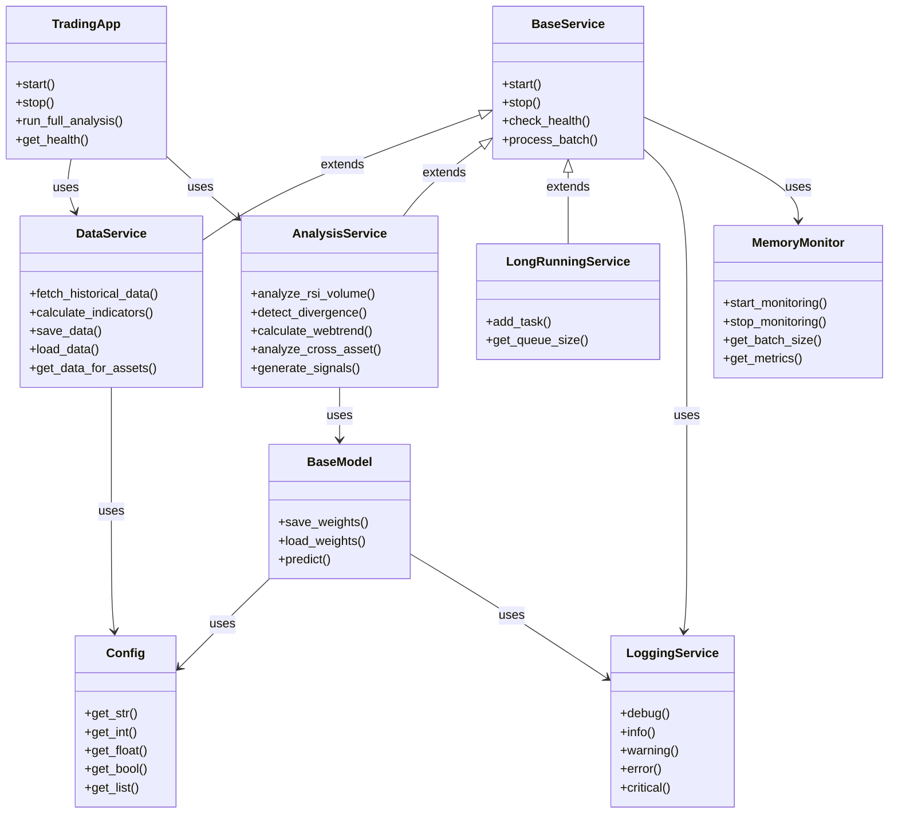
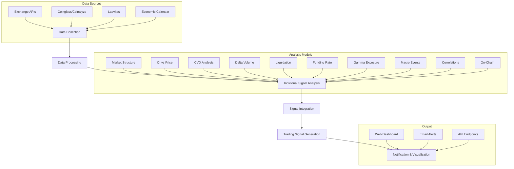
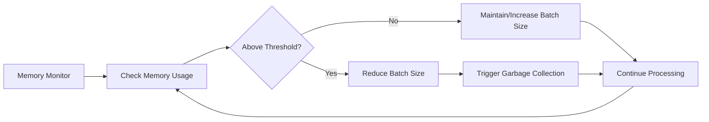
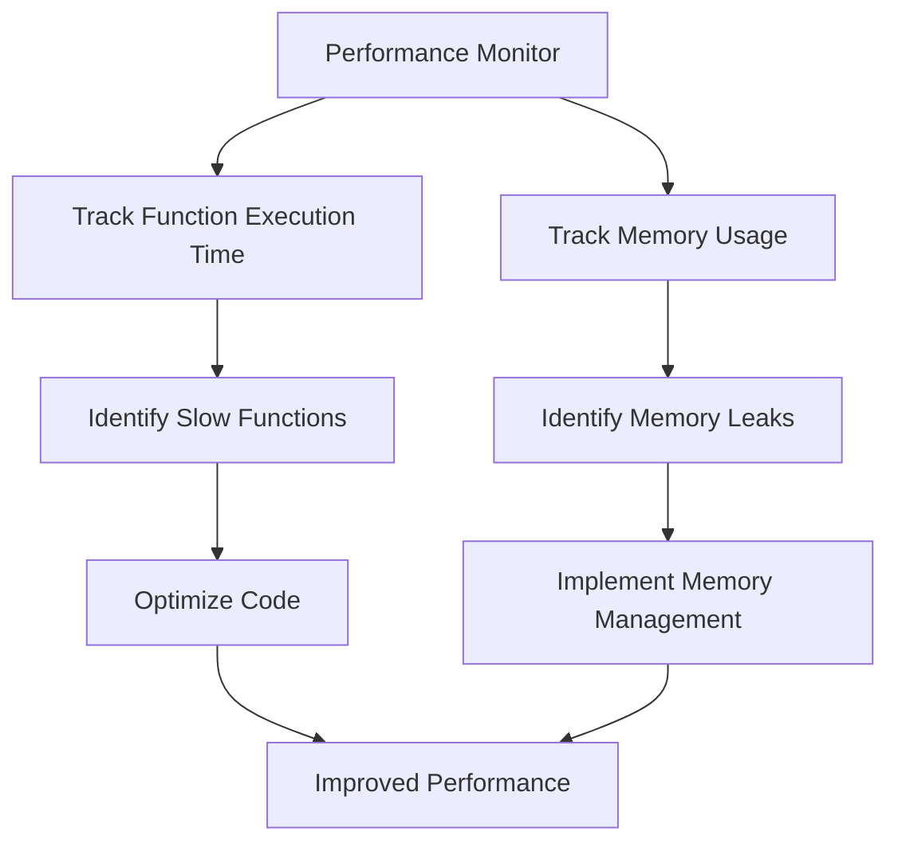
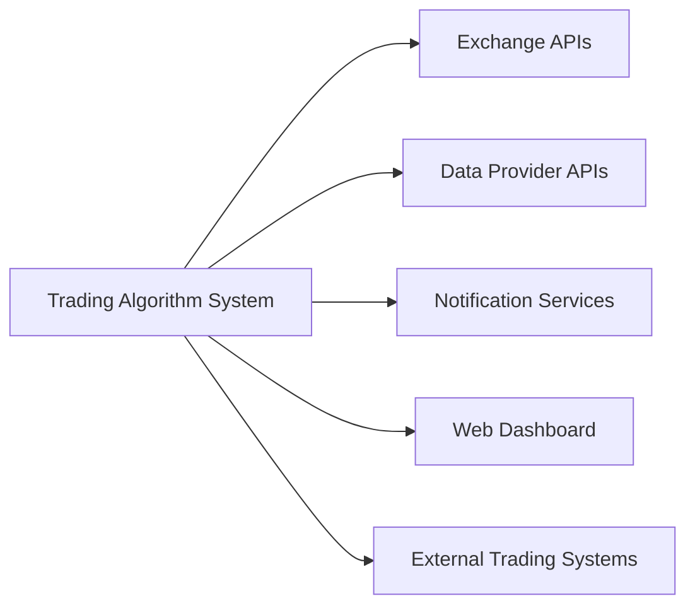

# Trading Algorithm System - Project Structure

## Overview

This document outlines the complete structure of our Trading Algorithm System, which integrates multiple data sources and analysis techniques to generate high-quality trading signals for cryptocurrency markets.

## System Architecture



## Directory Structure

```
trading-algorithm-system/
├── src/                    # Source code
│   ├── api/                # API endpoints and interfaces
│   ├── config/             # Configuration management
│   ├── core/               # Core application logic
│   ├── models/             # Trading models and algorithms
│   │   ├── market_structure/  # Market structure & price action analysis
│   │   ├── open_interest/     # Open Interest vs Price analysis
│   │   ├── cvd/               # Spot vs Perp CVD analysis
│   │   ├── delta_volume/      # Aggressor Volume analysis
│   │   ├── liquidation/       # Liquidation heatmap analysis
│   │   ├── funding/           # Funding rate analysis
│   │   ├── gamma/             # Gamma exposure analysis
│   │   ├── macro/             # Macro events analysis
│   │   ├── correlation/       # Cross-asset correlation analysis
│   │   └── onchain/           # On-chain analysis (optional)
│   ├── services/           # Shared services
│   │   ├── data_service.py    # Data collection and management
│   │   ├── analysis_service.py # Analysis orchestration
│   │   └── notification_service.py # Alerts and notifications
│   └── utils/              # Utility functions and helpers
├── docs/                   # Documentation
│   ├── guides/             # User and developer guides
│   ├── implementation_docs/ # Implementation details
│   ├── diagrams/           # System architecture diagrams
│   ├── api/                # API documentation
│   └── scripts/            # Utility scripts
├── data/                   # Data storage (not in repository)
│   ├── historical/         # Historical price data
│   ├── open_interest/      # Open interest data
│   ├── cvd/                # CVD data
│   ├── delta_volume/       # Delta volume data
│   ├── liquidation/        # Liquidation heatmap data
│   ├── funding/            # Funding rate data
│   ├── gamma/              # Options gamma exposure data
│   ├── macro/              # Macro events data
│   ├── correlation/        # Cross-asset correlation data
│   ├── onchain/            # On-chain data
│   └── weights/            # Model weights
├── tests/                  # Test files (co-located with source)
├── .env.example            # Example environment variables
└── MASTER_GUIDE.md         # Project master guide
```

## Key Components

### 1. Market Structure & Price Action


- BTC/SOL/BONK 4h charts with RSI, moving averages, and key levels
- Volume & Candlestick context
- Support/resistance identification

### 2. Open Interest vs Price Divergence


- OI climbing while price stalling → Bearish signal
- OI dropping while price rising → Potential reversal
- Sources: Coinalyze / CoinGlass / Laevitas

### 3. Spot CVD vs Perp CVD


- Detects if perps are leading (impulse driven) or lagging (spot driven)
- Spot CVD rising faster → spot-led move (more sustainable)
- Perp CVD rising faster → perp-led move (possibly fakeout)
- Source: Coinalyze

### 4. Delta (Aggressor) Volume Imbalance


- Identifies whether buy/sell side is being aggressed
- Sell volume delta spikes at resistance = short trigger
- Sources: Coinalyze / Tensorcharts / Hyperliquid

### 5. Liquidation Map


- Identifies local tops/bottoms via clusters of long/short liquidations
- Sources: CoinGlass / Hyblock / Hyperliquid

### 6. Funding Rate & Bias Tracking


- Detects if crowd is overly long or short
- Consistently high funding = overbought / potential reversal
- Negative funding = crowd shorting → squeeze opportunity
- Source: CoinGlass

### 7. Gamma Exposure / Option Flow


- Calls stacked at specific levels = resistance
- Gamma flip zones = volatility expected
- Source: Laevitas

### 8. CPI / Macro Events


- Impact volatility sharply
- Sources: Forex Factory / Economic Calendar

### 9. Correlations – BTC vs SOL vs BONK


- If SOL or BONK pumps before BTC → use that for early entries
- Sources: TradingView / CoinMetrics

### 10. On-Chain Flows (Optional)


- Exchange inflows/outflows
- Whale alerts, Miner sell pressure
- Sources: CryptoQuant / Glassnode

## Signal Integration Flow



## Memory Management

The system implements adaptive memory management for handling large datasets efficiently:



## Performance Optimization

The system uses performance monitoring to identify and optimize bottlenecks:



## Integration with External Systems


